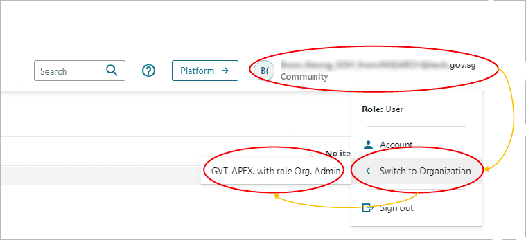
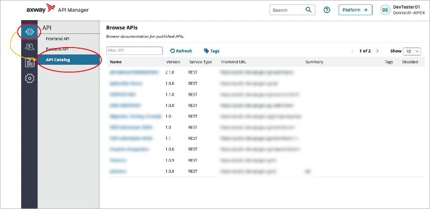
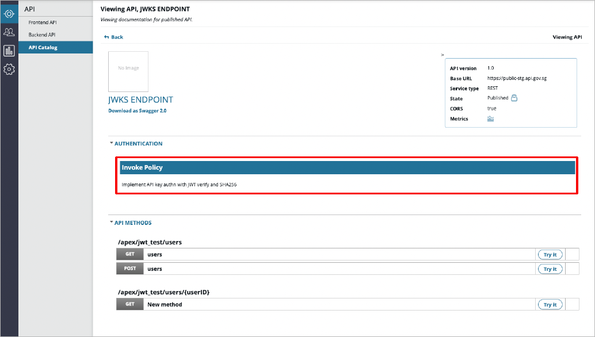

# Browse APIs

To browse the APIs that are available for you to use, you need to ensure that you are logged in to the right organization.

In API Manager, you can check the organization you are associated to by clicking your **name in the upper right corner > Switch to Organization**.

Organizations are used to group APEX Cloud users, applications, and APIs. 

## View API Catalog 

The API Catalog view contains a list of the APIs that are accessible to your organization.

You can view the API Catalog by going to **API > API Catalog**.

### View API Authentication Policy

To view an API's authentication policy, select the API in the API Catalog. On the API page, go to the **Authentication** section.

