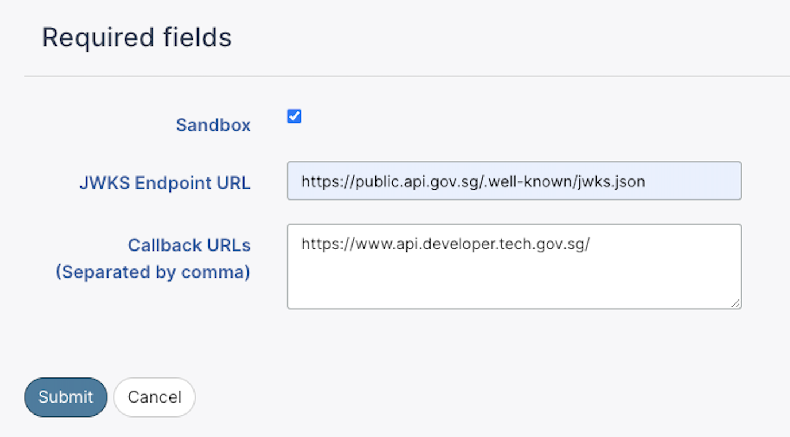
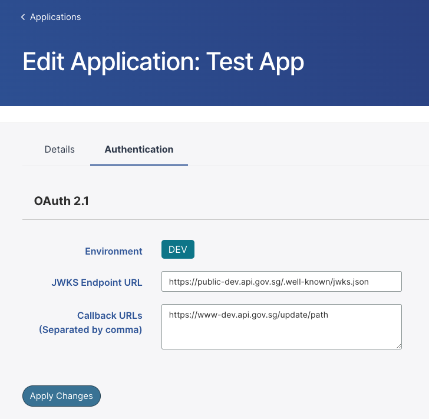

# Oauth 2.1

## Onboard Application with Oauth 2.1

1. **Apps** tab > Click **Application**

2. Search for **Oauth 2.1** > Click on the link **Click here to onboard**

3. Add **JWKS endpoint** and **callback URLs** > Click **Submit**

   - Make sure the app description is not empty.
   - Multiple callback URLs are allowed with the seperation of comma.

   

Once application is onboarded successfully, the portal will be redirected back to the application page with the following view in Oauth 2.1. The **login url (example)** are just demonstration on how the login url can be constructed with the supplied callbacks. **It cannot be use for production**.

### Note:

Once the application is onboarded to OAuth 2.1 successfully, portal disable the function to delete the application. OAuth 2.1 status needs to be updated as "inactive" before deleting.

1. Search for **Oauth 2.1** > Click on **Change Status to inactive**.
2. Once the status become inactive, proceed to delete the application.

## Onboard Application with Oauth 2.1 (Sandbox)

_Update: This feature will be available in end Feb 2023._

SANDBOX is only available in PROD environment and the option will only be provided when onboarding to Oauth 2.1.

1. **Apps** tab > Click **Application**

2. Search for **Oauth 2.1** > Click on the link **Click here to onboard**.

3. Check **sandbox checkbox** > Add **JWKS endpoint** and **callback URLs** > Click **Submit**.

3. Once application is onboarded successfully, the portal will be redirected back to the application page with SANDBOX tag in Oauth 2.1 section.

### After onboarded to SANDBOX, you can create app in PROD with the same appplication.

1. **Apps** tab > Click **Application**.

2. Search for **Oauth 2.1** > Click **Create App in PROD**.

3. Add **JWKS endpoint** and **callback URLs** > uncheck **sandbox checkbox** (default option) > Click **Submit**.

4. Once onboarded to Oauth 2.1 in both SANDBOX and PROD environment, you can toggle between SANDBOX and PROD to view the details and registered ID in **Apps** tab > Select **Application**.

### After onboarded to PROD, you can create app in SANDBOX with the same appplication.

Same steps can be apply as [above](#after-onboarded-to-sandbox). **Create App in SANDBOX** will appear in app > Oauth 2.1 section.

### Note:

OAuth 2.1 SANDBOX and PROD in both SANDBOX and PROD need to be updated as "inactive" before deleting.

1. View **Oauth 2.1** > Click **Change Status to inactive**
2. Click **Change to Sandbox** > Click **Change Status to inactive**
3. Once both status become inactive, proceed to delete the application.

## Update JWKS endpoint or callbackURLs

1. **Apps** tab > **Select Application** > Click **Edit Application**
2. View **Authentication** tab > **Oauth 2.1**
3. Update **JWKS endpoint** or **callback URLs** > Click **Apply Changes**

4. If there are app createed in both SANDBOX and PROD, select either "sandbox" or "prod" > Update **JWKS endpoint** or **callback URLs** > Click **Apply Changes**

