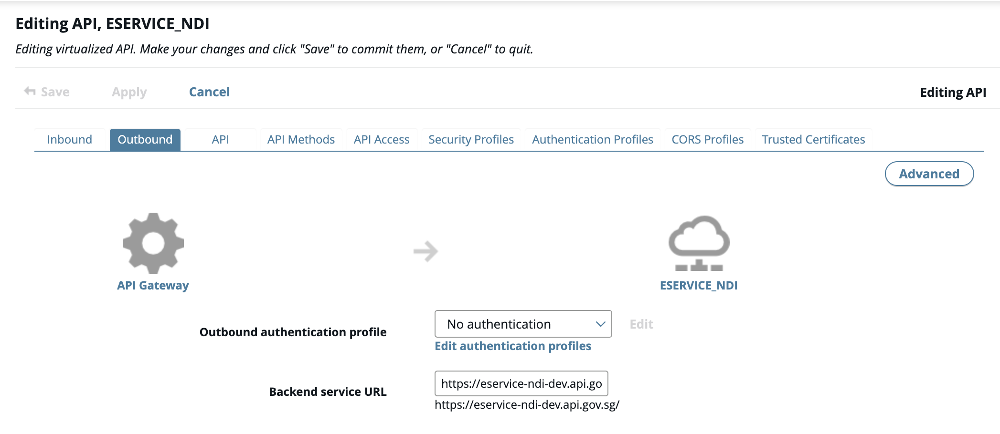
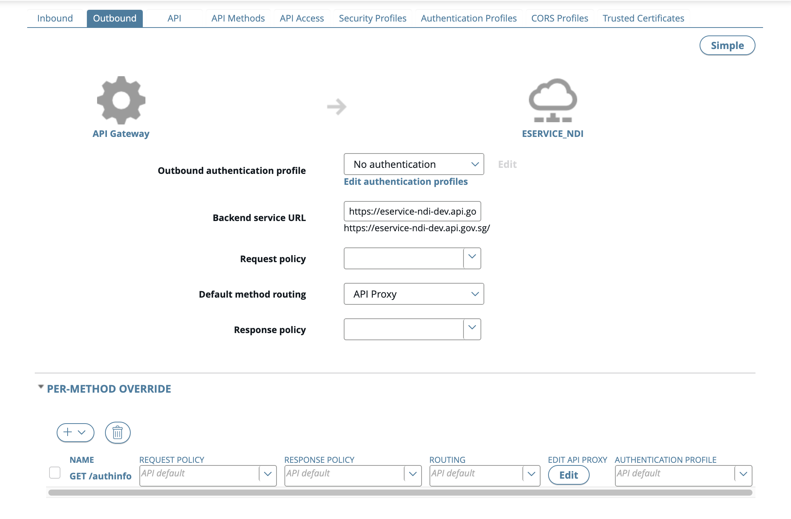

# Published API (Frontend API)

## Create New API

### Import from Backend API

1. Click the **API > Frontend API** in API Manager.
2. Click **New API > New API from backend API**.


3. Select an existing back-end API in the dialog, and click **Create**.


### Import API via .dat file

1. Click **API > Frontend API view** in API Manager.
2. Click **New API > Import API collection**.
3. In the **Import** from dialog, complete the following:
   - **File**: Click to browse to the previously exported API (.dat file).
   - **Password**: Enter the password if required.
   - **Organization**: Select the organization from the list.
4. Click **Import**.
5. **Press F5** to **reload** the API Manager web console.


## Configure Inbound Request Settings

Configuration for inbound request settings between the client and the API Gateway:

1. Select the **Inbound** tab.
2. Edit **Resource** path for the API.
   
3. Select API Key from the **Inbound Security** list.
   - **API key field name**: Enter name for API key field in the inbound request.
   - **API key location**: Select Request Headers or Query string/form body.
   - **Remove credentials on success**: Default to enable it. Inbound authorization header will be removed to use different authentication method for the outbound to the backend services.
     
4. Click the **Advanced** button on the right to configure settings such as monitoring, sharing resources across domains, and per-API method overrides.

## Configure Outbound Request Settings

Configuration of the outbound request settings between the API Gateway and the backend services:

1. Select the **Outbound** tab.
2. Select an **authentication profile** for the backend services.
   - [No Authentication](#no-authentication)
   - [HTTP Basic authentication](#http-basic-authentication)
   - [API Key authentication](#api-key-authentication)
     
3. Click the **Advanced** button on the right to configure settings such as request or response processing, routing, and per-API method overrides. Advance option can be use in situation where additional headers (e.g. client ID and secret) are required.
   
4. Click **Apply**.

### Additional Setting: Request Policy - Generate_AWS_SigV4

Generate_AWS_SigV4 generates AWS signature, and adds Authorization and amzdate to the headers in the outbound between APEX-cloud gateway and AWS gateway. See https://docs.aws.amazon.com/general/latest/gr/signature-version-4.html for AWS Signature Version 4 signing process.

1. Choose **No Authentication** in **authentication profile**
2. Select **Generate_AWS_SigV4** in **Request Policy**.
3. **Expand pre-method override > Click + sign > Select API**.
4. Click **Edit API Proxy**.
5. Input the necessary parameters
   - **aws-access-key**: AWS client access key.
   - **aws-secret-key**: AWS client secret key.
   - **aws-service** e.g. execute-api
   - **aws-host**: AWS domain name or endpoint.
   - **aws-region**: AWS region.
   - **aws-additional-signed-headers**: Additional headers that required to be signed e.g. x-apigw-api-id
   ```
   aws-additional-signed-headers: header1;header2;header3
   header1: value1
   header2: value2
   header3: value3
   ```
   
6. Click **Apply**.

Note:

- Empty string is the default value if the params.headers value is null or undefiend. This may cause the signature generated to be invalid.
- Additional headers value need to be present. Else, there will be error generating the signature.

### Additional Setting: Request Policy - Verify_JWT (To be updated)

### Additional Setting: Request Policy - Verify_JWT_And_Generate_AWS_SigV4 (To be updated)

This policy combined both Veryify_JWT and Generate_AWS_SigV4 as the authentication between gateway and client gateway.

### No Authentication

No authentication is performed between the API Gateway and the backend API.

### HTTP Basic Authentication

**Name**: Enter a required name for the profile. Defaults to HTTP Basic.

**Username**: Enter the required username (API key).

**Password**: Enter the optional password (API secret).

### API Key Authentication

**Name**: Enter a required name for the profile.

**API key field name**: Enter name for API key field in the outbound request.

**API key**: Enter the API key.

**Pass credentials as HTTP**: Select Header, Query string or Form of the API key in the outbound request.

## API Method

API Method display the list of method and it provides build-in test to check if APIs is functioning as expected before publication.

1. Click **API > Frontend API view**.
2. **Select API > click API Method** tab
3. Click **Try Method** to perform the test for any endpoint(s) specified


Alternatively, testing can also be done in API Catalog.

4. Click **API > API Catalog**.
5. Select **API** for display.
6. **Add authentication** required as specified.
7. Click **Try it** to perform the test.

## Publish API

1. Click **API > Frontend API view > Select API** in API Manager.
2. Click **Manage Selected** and select **Publish**.
3. Enter **Virtual Host** and click **Publish**.


## Manage Frontend API Lifecycle

1. Click **API Registration > Frontend API view** in API Manager.
2. **Select API**
3. Click **Manage Selected** and select any of the following
   - **Unpublish API(s)**.
   - **Delete and Update** API(s). (TODO: to check. api manager do not see the update option.)
   - **Grant access** to organisation(s). Refer to [Manage access to APIs](/publisher/manage-access-to-apis/).
   - **Export API(s)** to .dat extension.

// add update api
// the updated version should show in the app
// only active will be presented
// retired only developer will see. consumer unable to see retired apis.
