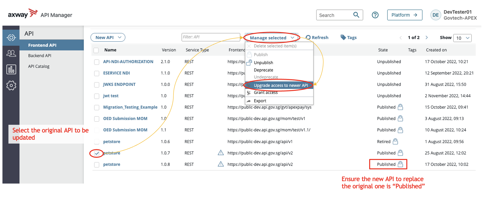

# Update API
It is not possible to make any changes to an API in published state. What we recommend is to upgrade your API. By upgrading your API it provides a seamless integration of your API changes to the consumer, as long as your changes is not a breaking change.

> If you were to unpublish your API and update the API, a full reintegration of the API with the consuming APP is not possible without consumer's intervention. This will cause the API calls to fail.

1. Create API to recreate the backend API with the necessary changes (if any), follow the [Create API](docs/publisher/create-api.md) steps. Do update the version number, to reflect that this is of a later version.

2. Publish API to recreate the frontend API with the necessary changes (if any), follow the [Publish API](docs/publisher/publish-api.md) steps. Please ensure that the setup of the frontend API is similar to that of the original version.

3. Upgrade access of original API to new API by selecting the original API > Manage selected > Upgrade access to newer API

A pop up will appear to select the newly created API to upgrade original API to.

